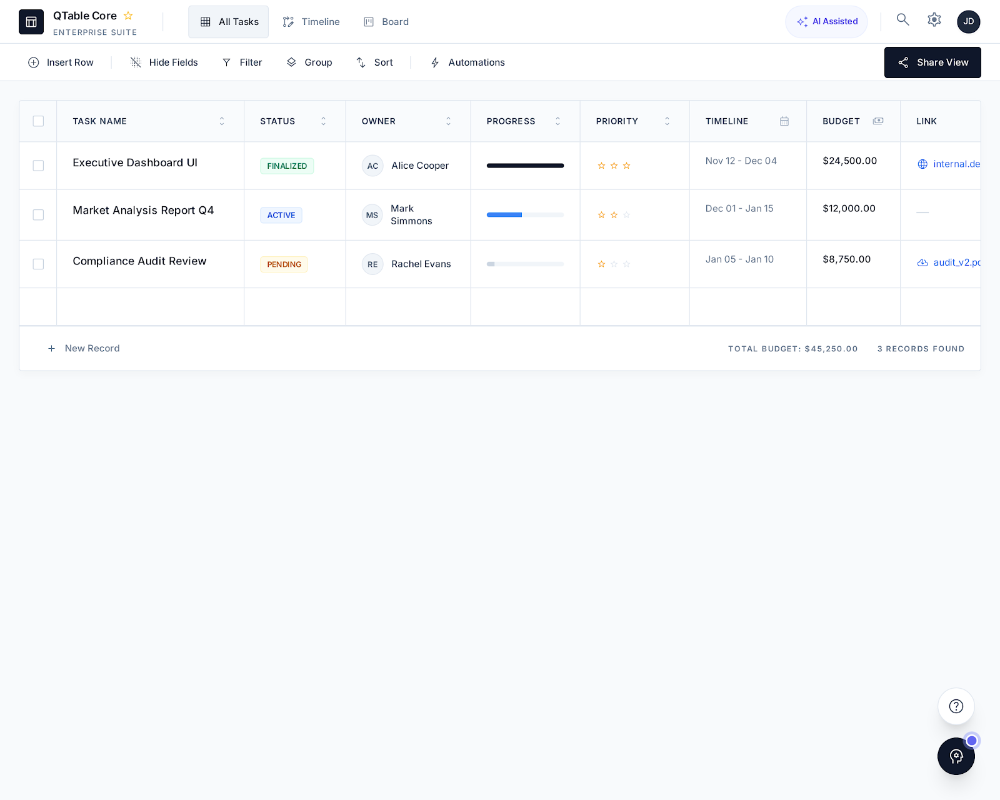
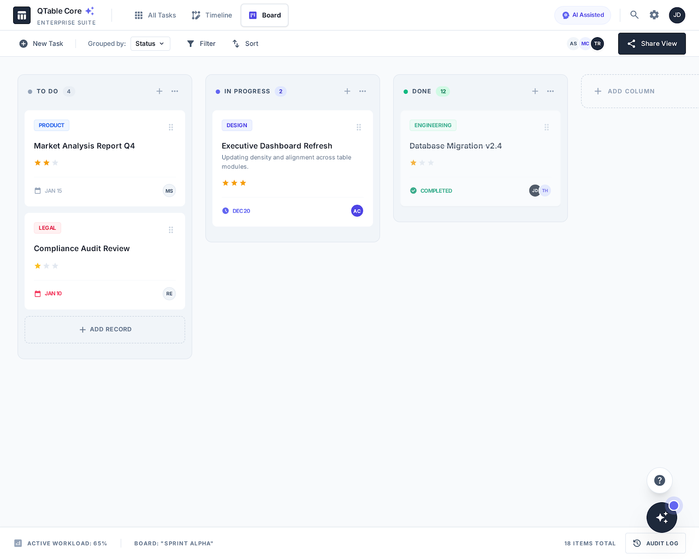

# QTableUI

> React frontend for [QTable](https://github.com/QingZoneX/QTable), an AI-native open-source project and work management system.

**Status:** `v0.1.0-alpha` release candidate — private release preparation, **not yet publicly released**.

QTableUI provides the interactive multidimensional-table experience for QTable: Grid, Kanban, Gantt, Calendar, Gallery, dashboards, AI planning workflows and the QNote Source Inbox.





## Stack

- React 19
- TypeScript 7
- Vite / Rolldown
- Ant Design 6
- VTable / VTable Gantt
- Apollo Client
- Zustand
- VChart
- react-grid-layout

## Local development

Requirements:

- Node.js 22
- a running QTable API on port 9000

```bash
git clone https://github.com/QingZoneX/QTableUI.git
cd QTableUI
npm ci
npm run dev
```

The development server listens on <http://localhost:9100> and proxies API / GraphQL / WebSocket / OAuth traffic to <http://localhost:9000>.

No real credential belongs in frontend environment variables.

npm and `package-lock.json` are the supported reproducible install path. The
obsolete pnpm lockfile has been removed to prevent resolving a different tree.

## Full self-hosted stack

The canonical one-command stack is maintained in the QTable backend repository.

Clone both repositories as siblings:

```text
qingzone/
├── QTable/
└── QTableUI/
```

Then:

```bash
cd QTable
cp .env.example .env
docker compose up --build -d
```

Open <http://localhost:9100>.

The backend repository's canonical Compose stack keeps PostgreSQL, Redis, MinIO and the QTable API loopback-only on the host by default; QTableUI is the intended user-facing entry point.

## Docker Hub image

After the corresponding verified release tag is published, the official image is:

```text
qingzonex/qtable-ui:0.1.0-alpha
```

Pull and run it against an existing QTable API:

```bash
docker pull qingzonex/qtable-ui:0.1.0-alpha

docker run --rm -p 9100:9100 \
  -e QTABLE_HOST=host.docker.internal \
  -e QTABLE_PORT=9000 \
  qingzonex/qtable-ui:0.1.0-alpha
```

The image is designed to be published for both `linux/amd64` and `linux/arm64`, carries OCI source/version/revision/license metadata, includes the Apache-2.0 `LICENSE` and `NOTICE`, exposes `/healthz`, and is published with BuildKit SBOM and provenance attestations. Prerelease tags such as `0.1.0-alpha` deliberately do not receive the `latest` tag.

The image is not considered published merely because the workflow exists. The first official Docker Hub push remains downstream of the exact-revision QTable/QTableUI release gates described below.

Maintainers configure Docker Hub publishing through GitHub Actions repository configuration, never source files: set `DOCKERHUB_USERNAME`, `DOCKERHUB_TOKEN`, and optionally `DOCKERHUB_NAMESPACE` (defaults to `qingzonex`). A `v*` Git tag must exactly match `VERSION`, `package.json`, and the root `package-lock.json` version before the workflow will push.

For the complete PostgreSQL + Redis + object-storage + QTable + QTableUI deployment, use the Docker Hub consumer Compose file maintained in the QTable backend repository.

## Docker

Build only the UI image from source:

```bash
docker build -t qtable-ui .
docker run --rm -p 9100:9100 \
  -e QTABLE_HOST=host.docker.internal \
  -e QTABLE_PORT=9000 \
  qtable-ui
```

Builds use the official Node/Nginx images and npm registry by default. Package
versions and integrity hashes stay pinned in `package-lock.json`. If your network
requires mirrors, select them explicitly:

```bash
docker build -t qtable-ui \
  --build-arg NODE_IMAGE=docker.m.daocloud.io/library/node:22-alpine \
  --build-arg NGINX_IMAGE=docker.m.daocloud.io/library/nginx:alpine \
  --build-arg NPM_REGISTRY=https://registry.npmmirror.com .
```

For local npm installs, use `npm ci --registry=https://registry.npmmirror.com`
when needed; do not regenerate the lockfile just to change download mirrors.

Runtime variables:

| Variable | Default | Purpose |
| --- | --- | --- |
| `PORT` | `9100` | Nginx listen port |
| `QTABLE_HOST` | `qtable` | backend host |
| `QTABLE_PORT` | `9000` | backend port |

`/healthz` is available as a container health endpoint.

On a Linux Docker host, run the same container smoke test as CI:

```bash
python3 scripts/check-docker-runtime.py qtable-ui
```

It checks default/custom listen ports, SPA deep links, missing static assets,
REST/GraphQL/Auth/OAuth proxying, header/body forwarding, production security
headers, and frontend liveness when the backend stops. It uses a temporary mock
upstream with host networking; it does not replace full-product authentication
or WebSocket/browser E2E tests.

## Production browser security headers

The canonical QTableUI Nginx container sets browser security headers itself so a
plain self-host does not depend on a particular gateway implementation:

- `X-Content-Type-Options: nosniff`;
- `Referrer-Policy: strict-origin-when-cross-origin`;
- clickjacking protection through CSP `frame-ancestors 'none'` plus
  `X-Frame-Options: DENY` for compatibility;
- a restrictive `Permissions-Policy` for camera, microphone, geolocation,
  payment and USB;
- a default Content Security Policy that limits application scripts, images,
  fonts, connections, workers and frames to the origins needed by the current
  QTableUI runtime.

`script-src` deliberately does **not** allow `unsafe-inline` or `unsafe-eval`.
The Service Worker bootstrap runs from the normal Vite/TypeScript bundle rather
than an inline `<script>`. `style-src 'unsafe-inline'` is currently retained
because Ant Design and the existing runtime styling path inject style rules at
runtime; removing it requires a separate styling/nonces migration and must not be
worked around by weakening script policy.

An outer reverse proxy or ingress still owns transport-layer concerns such as TLS
certificate management, HTTP-to-HTTPS redirects and HSTS. It may add stricter
headers, but it should not silently delete or broaden QTableUI's CSP. If a
deployment intentionally embeds QTableUI in another origin, or adds external
asset/API origins, review and narrow the CSP explicitly rather than disabling it.

## Product safety invariants

Frontend changes must preserve the backend security model:

- do not load hidden rows in order to implement client-side AI or analytics;
- do not bypass Preview → Confirm → Apply flows;
- do not write records directly when an atomic audited mutation exists;
- Workspace Member candidates must come from the current workspace;
- public dashboard pages must use public-token-safe APIs;
- large-table paths should preserve server paging / aggregation rather than downloading the entire table.

## Quality gates

```bash
node scripts/check-secrets.mjs --history
node scripts/check-open-source-readiness.mjs
npm run check:dependencies
npm run check:licenses
npm run test:license-policy
npm run test:xlsx-export
npm run build
```

Frontend CI also runs contract checks for OAuth, search, AI goal/workload/steward flows, AI visual design, Member fields and Source Inbox behavior.

See [CONTRIBUTING.md](CONTRIBUTING.md), [SECURITY.md](SECURITY.md) and the
[dependency policy](docs/dependency-policy.md). CI publishes dependency audit,
license inventory and CycloneDX SBOM artifacts for the tested commit.

## Rainbond

The existing Dockerfile and `rainbondfile` remain supported. Set the QTable backend component port alias to `QTABLE`, establish a QTableUI → QTable dependency, and expose UI port 9100 through the gateway.

## Release status

`v0.1.0-alpha` is being prepared as the first QTable **Open Source Preview / Alpha**. The current QTableUI `main` state is a private pre-release candidate, not a published release. It becomes release evidence only after real Frontend CI and the exact-revision full-stack release E2E execute successfully, QTable#139 / QTable#170 / QTableUI#86 are complete, the repositories intentionally become public, and the verified tag/release is created. The Docker Hub workflow is part of that release mechanism and must publish the same verified Git revision, not a manually rebuilt or unrelated image.

See the explicitly draft [docs/releases/v0.1.0-alpha.md](docs/releases/v0.1.0-alpha.md).

## License

Apache License 2.0. See [LICENSE](LICENSE).
